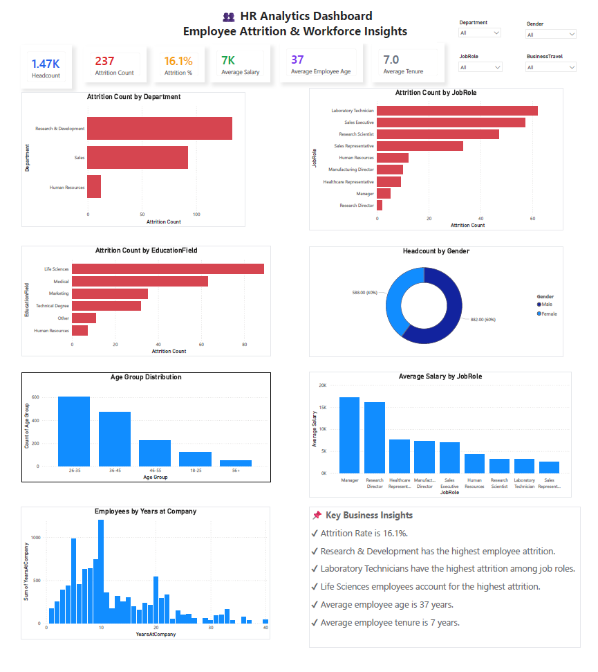

 # 👥 HR Analytics Dashboard

An interactive **HR Analytics Dashboard** built using **Microsoft Power BI** to analyze employee attrition, workforce demographics, salary distribution, and tenure trends. The dashboard enables HR professionals and decision-makers to identify key factors influencing employee turnover and make data-driven workforce decisions.

---

## 📊 Dashboard Preview

> **Dashboard Screenshot**

<p align="center">
  
</p>

---

## 🚀 Project Overview

Employee attrition is one of the biggest challenges organizations face. This dashboard provides comprehensive insights into workforce composition, attrition patterns, salary distribution, and employee demographics through interactive visualizations.

The report allows HR teams to:

- Monitor employee attrition
- Identify departments with high turnover
- Analyze attrition by job role
- Understand workforce demographics
- Explore salary trends
- Gain actionable business insights

---

# 🎯 Objectives

- Analyze employee attrition trends
- Monitor overall workforce metrics
- Identify departments and job roles with the highest attrition
- Explore demographic distributions
- Compare average salary across job roles
- Provide actionable HR insights using interactive dashboards

---

# 🛠 Tools & Technologies

- Microsoft Power BI
- DAX (Data Analysis Expressions)
- Microsoft Excel
- Data Visualization
- Business Intelligence

---

# 📂 Dataset

The dashboard is built using the **IBM HR Analytics Employee Attrition & Performance Dataset**.

### Dataset includes:

- Employee Demographics
- Department
- Job Role
- Education Field
- Business Travel
- Monthly Income
- Years at Company
- Attrition Status
- Gender
- Age
- Job Satisfaction
- Performance Rating

---

# 📈 Dashboard Features

## 📌 KPI Cards

- 👥 Headcount
- 🚪 Attrition Count
- 📉 Attrition Rate
- 💰 Average Salary
- 🎂 Average Employee Age
- ⏳ Average Employee Tenure

---

## 📊 Interactive Visualizations

- Employee Attrition by Department
- Employee Attrition by Job Role
- Employee Attrition by Education Field
- Headcount by Gender
- Age Group Distribution
- Average Salary by Job Role
- Employees by Years at Company

---

## 🎛 Interactive Filters

Users can filter the dashboard using:

- Department
- Gender
- Job Role
- Business Travel

---

# 💡 Key Business Insights

- Employee Attrition Rate is **16.1%**
- Research & Development department has the highest attrition.
- Laboratory Technicians have the highest employee turnover.
- Life Sciences employees contribute the highest attrition.
- Average employee age is **37 years**.
- Average employee tenure is **7 years**.

---

# 📸 Dashboard Screenshot

<p align="center">

</p>

---

# 📊 KPIs

| KPI | Value |
|------|-------|
| Headcount | 1,470 |
| Attrition Count | 237 |
| Attrition Rate | 16.1% |
| Average Salary | 6.5K |
| Average Employee Age | 37 Years |
| Average Tenure | 7 Years |

---

# 📁 Repository Structure

```
HR-Analytics-Dashboard/
│
├── Dashboard.pbix
├── HR_Analytics.csv
├── dashboard.png
├── README.md
└── LICENSE
```

---

# ⭐ Future Improvements

- Department-wise drill-through reports
- Employee-level detail page
- Predictive attrition analysis using Machine Learning
- Power BI Service deployment
- Row-Level Security (RLS)
- Dynamic tooltips and bookmarks

---

# 📚 Skills Demonstrated

- Data Cleaning
- Data Modeling
- DAX Measures
- Dashboard Design
- Interactive Reporting
- KPI Development
- HR Analytics
- Business Intelligence
- Data Visualization

---

# 👨‍💻 Author

**Harshit Choudhary**

📧 Email: harshitchoudhary.connect@gmail.com

🔗 LinkedIn: https://www.linkedin.com/in/harshit-choudhary-31683228b

🐙 GitHub: https://github.com/Harshit786zs

---

# 🌟 If you found this project useful

Give this repository a ⭐ on GitHub!

Feedback and suggestions are always welcome.
